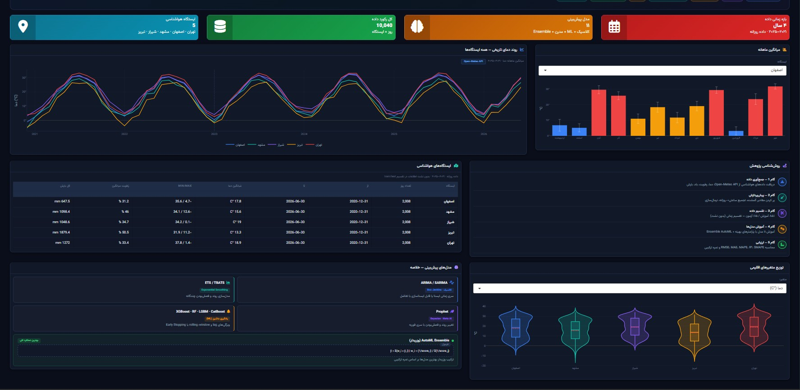
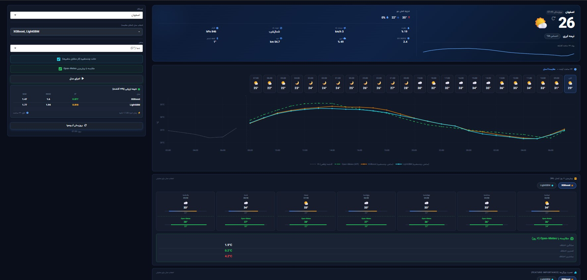
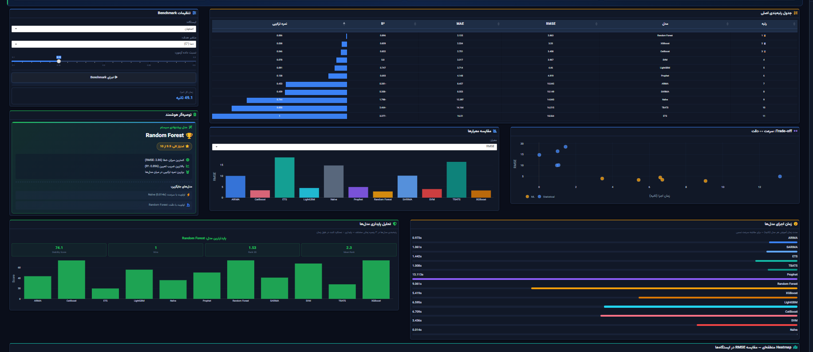

# 🌤️ WFS Dashboard — Iran Weather Forecast System

<p align="center">
  
  
  
  
  
</p>

An R Shiny dashboard that forecasts weather for 5 Iranian cities using 11 statistical and machine-learning models, benchmarks them against each other on accuracy, speed, and stability, and exports the results as a shareable Excel/PDF report.

**Highlights**
- **11 forecasting models** — ARIMA, SARIMA, ETS, TBATS (classical), Prophet (Bayesian), and Random Forest, XGBoost, LightGBM, CatBoost, SVM, Naive (ML/baseline) — plus a weighted AutoML ensemble on top
- **Full benchmark suite**: leaderboard, speed test, rolling-window stability test, and a cross-station regional heatmap
- **Live forecasting** for 5 cities — current conditions + 7-day outlook, cross-checked against the Open-Meteo API in real time
- **One-click report export** to Excel or PDF
- **Dark-themed, RTL Persian interface** built with R Shiny

---

## 📸 Screenshots

<p align="center">
  <br>
  <sub>Overview — dataset stats, historical trends, and methodology</sub>
</p>
<p align="center">
  <br>
  <sub>Weather Forecast — live conditions, hourly chart, 7-day outlook</sub>
</p>
<p align="center">
  <br>
  <sub>Model Benchmark — leaderboard, trade-off analysis, regional heatmap</sub>
</p>
<p align="center">
  <br>
  <sub>Report Export — configurable Excel/PDF exports</sub>
</p>

*Save your screenshots under these names in an `images/` folder in the repo (or edit the paths above to match your own).*

---

## ✨ Features

### 🏠 Overview
- Dataset stats at a glance: 5 stations, 10,040 daily records, 11 models
- Historical temperature trend across all 5 stations in one chart, plus monthly averages per station
- Per-station climate summary table (avg/min/max temperature, humidity, total precipitation, date coverage)
- 5-step methodology pipeline, from data collection to evaluation
- Model-family cheat sheet and climate variable distributions (violin plots)

### 📈 Weather Forecast
- Pick a station, one or more models to compare, and a target variable — with an optional multivariate mode that feeds humidity/wind/pressure into ML models as covariates
- Live conditions card: temperature, feels-like, pressure, wind, humidity, dew point, visibility, cloud cover, UV index, and a 24h trend sparkline
- Hourly strip (past 24h + next 24h) with weather icons
- Forecast chart with a 95% confidence band, plotted against the Open-Meteo API for comparison
- Rolling 24h backtest metrics (MAE, RMSE, R², runtime)
- 7-day forecast cards, switchable by model

### 🏆 Model Benchmark & Leaderboard
- Configurable benchmark run: station, target variable, train/test split ratio
- Leaderboard of all 11 models ranked by a composite score (plus R², MAE, RMSE)
- Auto-recommended model with a 1–10 overall score and reasoning, plus "fastest" and "most accurate" alternatives
- Metric comparison chart, speed-vs-accuracy trade-off scatter, rolling-window stability analysis, per-model speed benchmark, and a regional performance heatmap across all 5 stations

### 🚨 Anomaly Detection
Flags observations that deviate significantly from model expectations.

### 📖 Model Guide
A quick reference explaining what each model family assumes and when to reach for it.

### 📤 Report Export
- Configure station, report title, analyst name, date range, and which sections to include (forecast, metrics, anomalies, ranking)
- Export as a multi-sheet Excel workbook or an executive-summary PDF (charts + performance tables)
- Live preview of report data before exporting

---

## 📊 Example Benchmark Run
*Isfahan · temperature · 15% test split · 30.34s total runtime*

| Rank | Model | Composite Score | R² | MAE | RMSE | Runtime |
|:---:|:---|:---:|:---:|:---:|:---:|:---:|
| 1 | Random Forest | 0.008 | 0.898 | 2.089 | 2.835 | 7.78s |
| 2 | XGBoost | 0.018 | 0.897 | 2.228 | 2.853 | 3.72s |
| 3 | CatBoost | 0.049 | 0.852 | 2.751 | 3.408 | 3.91s |
| 4 | SVM | 0.080 | 0.800 | 3.317 | 3.967 | 2.60s |
| 5 | LightGBM | 0.093 | 0.747 | 3.714 | 4.460 | 4.25s |
| 6 | Prophet | 0.139 | 0.693 | 4.148 | 4.919 | 4.78s |
| 7 | ARIMA | 0.454 | -0.281 | 8.457 | 10.042 | 0.69s |
| 8 | SARIMA | 0.460 | -0.308 | 8.553 | 10.149 | 0.78s |
| 9 | Naive | 0.745 | -1.798 | 12.397 | 14.843 | 0.01s |
| 10 | TBATS | 0.857 | -2.464 | 14.164 | 16.515 | 0.63s |

Recommended model: **Random Forest** (overall score 9.9/10 — lowest error, highest R², best composite score). Fastest alternative: Naive (0.009s).

---

## 🧮 Ensemble Formula
The AutoML ensemble blends every model's forecast, weighted by inverse error, so more accurate models get proportionally more say in the final prediction:

```
ŷ = Σ(w_i × ŷ_i),   where w_i = (1/score_i) / Σ(1/score_j)
```

---

## 🛠️ Tech Stack

| Layer | Technology / Packages |
| :--- | :--- |
| **Language & Framework** | R (≥ 4.3), Shiny, shinydashboard |
| **Data Processing** | dplyr, tidyr, lubridate, zoo |
| **Statistical Modeling** | forecast, prophet |
| **Machine Learning** | ranger (RF), xgboost, lightgbm, catboost, e1071 (SVM) |
| **Visualization** | plotly, ggplot2, DT, shinycssloaders |
| **Reporting** | writexl / openxlsx, rmarkdown |
| **Data Source** | Open-Meteo API (live & historical weather data) |

---

## 🗄️ Data

Daily weather data for 5 Iranian cities, ~2,008 days each (Dec 2020 – Jun 2026), via [Open-Meteo](https://open-meteo.com/):

| Station | Avg Temp | Min / Max | Avg Humidity | Total Precip. |
|:---|:---:|:---:|:---:|:---:|
| Isfahan | 17.8°C | -4.7°C / 35.6°C | 31.2% | 647.5 mm |
| Mashhad | 15.6°C | -12.6°C / 34.1°C | 46.0% | 1,098.4 mm |
| Shiraz | 19.0°C | -0.1°C / 34.2°C | 34.7% | 1,048.6 mm |
| Tabriz | 13.3°C | -11.2°C / 31.9°C | 50.5% | 1,879.4 mm |
| Tehran | 18.9°C | -1.4°C / 37.8°C | 33.4% | 1,272.0 mm |

---

## 🧪 Methodology

1. **Data collection** — pull hourly/daily variables from the Open-Meteo API (temperature, humidity, wind, precipitation)
2. **Preprocessing** — fill missing values, aggregate hourly → daily, normalize
3. **Chronological split** — time-based train/test split with no leakage (default 85% / 15%, adjustable in the benchmark settings)
4. **Model training** — train all 11 models with tuned hyperparameters, plus the weighted AutoML ensemble
5. **Evaluation** — compute RMSE, MAE, MAPE, R², SMAPE, and a composite score

---

## 📂 Project Structure

```text
.
├── app.R                     # Main application entry point
├── global.R                  # Library imports, data loading, global functions
├── R/
│   ├── modeling_utils.R      # Training and inference for all 11 models + ensemble
│   ├── metrics_utils.R       # Error metrics and composite scoring
│   └── explainer_utils.R     # Explainable AI (XAI) utilities
└── modules/
    ├── overview_module.R     # Landing page: stats, trends, methodology
    ├── forecast_module.R     # Forecasting and live model comparison
    ├── benchmark_module.R    # Leaderboard, stability, speed, regional heatmap
    ├── anomaly_module.R      # Anomaly detection
    ├── guide_module.R        # Model reference guide
    └── report_module.R       # Excel/PDF report export
```

---

## 🚀 Installation & Setup

1. Install **R (≥ 4.3)** and **RStudio**.
2. Install the required packages:
   ```r
   install.packages(c("shiny", "shinydashboard", "shinyWidgets", "DT", "plotly",
                      "dplyr", "tidyr", "lubridate", "zoo", "httr", "jsonlite",
                      "forecast", "prophet", "ranger", "xgboost", "e1071",
                      "writexl", "rmarkdown"))
   ```
3. (Optional) For boosting models, install these separately:
   ```r
   install.packages("lightgbm")
   # Follow the official CatBoost documentation to install it
   ```
4. Clone the repository, open `app.R` in RStudio, and click **Run App**.

---
