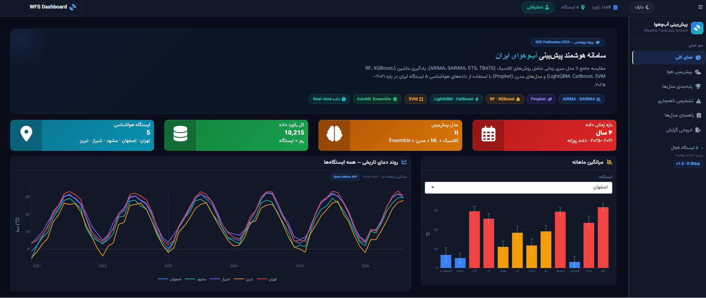

# WFS Dashboard — Iran Weather Forecast System

<p align="center">
  
  
  
  
  
</p>

An advanced R Shiny dashboard that forecasts weather for 5 Iranian cities using 11 statistical and machine-learning models. Version 2.0 introduces a **Direct Multi-Horizon** architecture, **Anomaly Targeting**, and **MOS Blending** to solve long-term forecast degradation in tree-based models.

**Highlights**
- **11 forecasting models + AutoML Ensemble** — ARIMA, SARIMA, ETS, TBATS, Prophet, Random Forest, XGBoost, LightGBM, CatBoost, SVM, Naïve, and a smart weighted Ensemble.
- **Advanced 7-Day Forecasting**: Uses *Direct Multi-Horizon* (independent models per day) and *Anomaly Targeting* (predicting deviation from climatology) to prevent error accumulation and flat-lines in ML models.
- **MOS Blending**: Option to blend ML predictions with Open-Meteo's NWP physics model for highly stable medium-range forecasts.
- **Full benchmark suite**: Leaderboard, speed test, rolling-window stability, and a regional heatmap based on a 24-hour hourly backtest.
- **Dark-themed, RTL Persian interface** built with R Shiny and Plotly.

---

## Screenshots

<p align="center">
  <br>
  <sub>Overview of dashboard</sub>
</p>

---

## Features

### Overview
- Dataset stats: 5 stations, ~35,000 hourly records per city (4 years).
- Historical temperature trend across all 5 stations, plus monthly averages.
- Per-station climate summary table (avg/min/max temperature, humidity, total precipitation).
- 5-step methodology pipeline and model-family cheat sheet.

### Weather Forecast
- **Live conditions card**: Temperature, feels-like, pressure, wind, humidity, dew point, visibility, cloud cover, UV index, and a 24h trend sparkline.
- **Dynamic 24h Strip**: Past 24h + next 24h with weather icons. Clickable model pills dynamically update the strip and bold the selected model in the main chart.
- **Main Forecast Chart**: 95% confidence band, past 6h actuals, and optional Open-Meteo API comparison overlay.
- **Rolling 24h Backtest**: MAE, RMSE, R², and execution time for every selected model.
- **7-Day Outlook (Cone of Uncertainty)**: 
  - Plots 14 days of actual Max/Min history.
  - Uses **Direct Multi-Horizon** models to forecast 7 days of Max/Min independently.
  - Applies seasonal clamping and day-over-day smoothing to prevent illogical jumps.
  - Optional **MOS Blending** to average ML output with Open-Meteo's NWP forecast.

### Model Benchmark & Leaderboard
- Runs a 24-hour hourly backtest (matching the forecast tab exactly).
- Leaderboard ranked by a composite score (R², MAE, RMSE, MAPE, SMAPE).
- Multivariate mode enabled by default for ML models (feeds humidity, wind, and pressure as covariates).
- Auto-recommended model with a 1–10 overall score, "fastest" and "most accurate" alternatives.
- Metric comparison charts, speed-vs-accuracy trade-off scatter, rolling-window stability, and a regional performance heatmap.

### Anomaly Detection
Flags observations that deviate significantly from model expectations using IQR and rolling-stats.

### Model Guide
A quick reference explaining what each model family assumes, complete with mathematical formulas (KaTeX) and pros/cons.

### Report Export
- Configure station, report title, analyst name, date range, and sections.
- Export as a multi-sheet Excel workbook or an executive-summary PDF.

---

## Advanced Forecasting Methodology

To overcome the limitations of tree-based models in time series extrapolation, the 7-day pipeline uses a multi-layered approach:

1. **Anomaly Targeting**: Instead of predicting raw temperature (which requires the model to understand seasons), the system calculates the climatological mean for each day of the year. Models are trained to predict the *anomaly* (difference from the mean). This reduces the learning burden to short-term persistence.
2. **Direct Multi-Horizon**: To prevent recursive error accumulation (where Day 7 is predicted based on Day 6's prediction), the system trains 7 independent models ($h=1...7$). Each model specializes in its specific horizon.
3. **Feature Engineering**: Lags (1, 2, 3, 7, 14 days), rolling means/stds, rate-of-change, and covariate lags (humidity, pressure).
4. **Safety Clamps**: Predictions are clamped to historical seasonal bounds (±15 days) to prevent physically impossible outputs (e.g., 15°C in August).
5. **MOS Blending**: If enabled, the final ML prediction is averaged with Open-Meteo's live NWP forecast, combining local statistical learning with global atmospheric physics.

---

## Example Benchmark Run
*Isfahan · temperature · 24h hourly test split · Multivariate*

| Rank | Model | Composite Score | R² | MAE | RMSE | Runtime |
|:---:|:---|:---:|:---:|:---:|:---:|:---:|
| 1 | AutoML Ensemble | 0.004 | 0.966 | 0.721 | 0.858 | 12.4s |
| 2 | SARIMA | 0.015 | 0.965 | 0.728 | 0.867 | 0.8s |
| 3 | Naïve | 0.021 | 0.962 | 0.746 | 0.909 | 0.01s |
| 4 | TBATS | 0.110 | 0.936 | 0.955 | 1.180 | 0.6s |
| 5 | Random Forest | 0.250 | 0.902 | 1.188 | 1.460 | 7.8s |
| 6 | Prophet | 0.310 | 0.897 | 1.272 | 1.495 | 4.8s |
| 7 | XGBoost | 0.950 | 0.660 | 2.416 | 2.718 | 3.7s |

*Note: In a 24-hour horizon, statistical models and Naïve baselines often compete closely with ML models due to weather persistence. The AutoML Ensemble consistently edges them out by blending the best performers.*

---

## Ensemble Formula
The AutoML ensemble filters out weak models and blends the strong ones using a Softmax-weighted approach based on inverse RMSE:

```
ŷ = Σ(w_i × ŷ_i)   |   w_i = exp(-β × RMSE_i) / Σ exp(-β × RMSE_j)
```

---

## Tech Stack

| Layer | Technology / Packages |
| :--- | :--- |
| **Language & Framework** | R (≥ 4.3), Shiny, shinydashboard |
| **Data Processing** | dplyr, tidyr, lubridate, zoo, readr |
| **Statistical Modeling** | forecast, prophet |
| **Machine Learning** | ranger (RF), xgboost, lightgbm, catboost, e1071 (SVM) |
| **Visualization** | plotly, ggplot2, DT, shinycssloaders |
| **Reporting** | writexl / openxlsx, rmarkdown |
| **Data Source** | Open-Meteo API (live & historical weather data) |

---

## Data

Historical hourly and daily weather data for 5 Iranian cities (~4 years), via [Open-Meteo](https://open-meteo.com/):

| Station | Avg Temp | Min / Max | Avg Humidity | Total Precip. |
|:---|:---:|:---:|:---:|:---:|
| Isfahan | 17.8°C | -4.7°C / 35.6°C | 31.2% | 647.5 mm |
| Mashhad | 15.6°C | -12.6°C / 34.1°C | 46.0% | 1,098.4 mm |
| Shiraz | 19.0°C | -0.1°C / 34.2°C | 34.7% | 1,048.6 mm |
| Tabriz | 13.3°C | -11.2°C / 31.9°C | 50.5% | 1,879.4 mm |
| Tehran | 18.9°C | -1.4°C / 37.8°C | 33.4% | 1,272.0 mm |

---

## Project Structure

```text
.
├── app.R                     # Main application UI & Server
├── global.R                  # Library imports, data loading, UTF-8 setup
├── start.R                   # Launcher script (sets working dir, locale, port)
├── R/
│   ├── data_utils.R          # API downloaders, feature engineering, data cleaning
│   ├── modeling_utils.R      # 11 models, Direct Multi-Horizon, Ensemble engine
│   └── metrics_utils.R       # Error metrics and composite scoring
└── modules/
    ├── home_module.R         # Landing page: stats, trends, methodology
    ├── forecast_module.R     # Live forecasting, 24h strip, 7-day Cone chart
    ├── leaderboard_module.R  # 24h hourly benchmark, stability, heatmap
    ├── anomaly_module.R      # Anomaly detection
    ├── model_guide_module.R  # Model reference guide + KaTeX formulas
    └── report_module.R       # Excel/PDF report export
```

---

## Installation & Setup

1. Install **R (≥ 4.3)** and **RStudio**.
2. Install the required packages:
   ```r
   install.packages(c("shiny", "shinydashboard", "shinyWidgets", "DT", "plotly",
                      "dplyr", "tidyr", "lubridate", "zoo", "httr", "jsonlite", "readr",
                      "forecast", "prophet", "ranger", "xgboost", "e1071",
                      "openxlsx", "rmarkdown", "shinycssloaders"))
   ```
3. (Optional) For boosting models, install these separately:
   ```r
   install.packages("lightgbm")
   # Follow the official CatBoost documentation to install it
   ```
4. Clone the repository, open `start.R` in RStudio, and click **Source** (or run `shiny::runApp()`).
